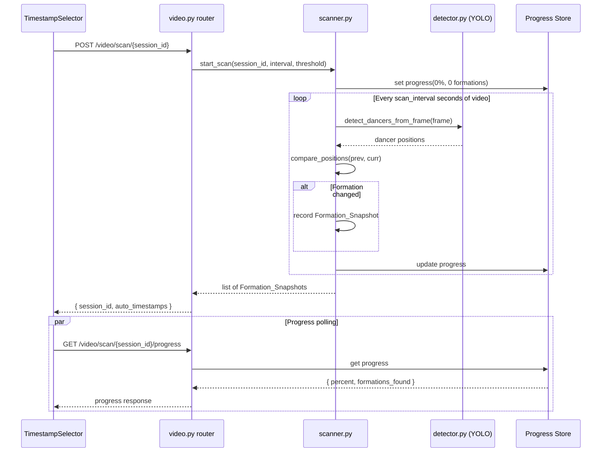
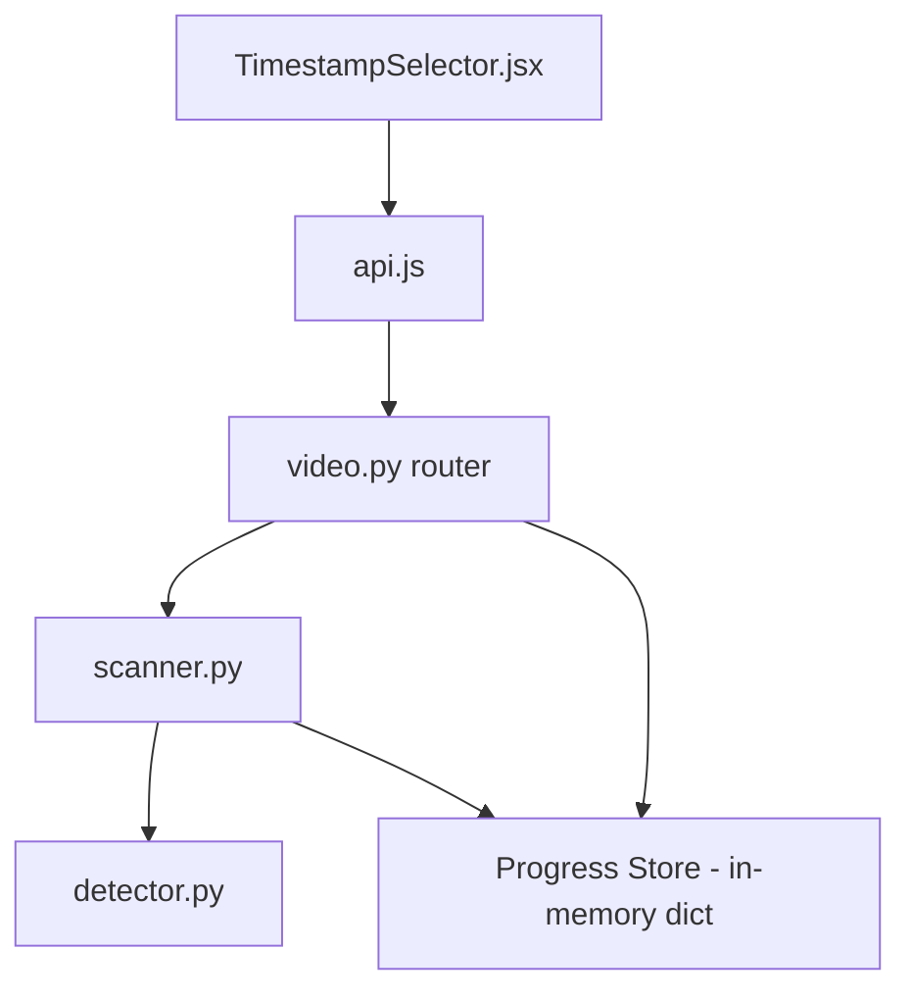

# Design Document: Auto-Scan Formations

## Overview

This feature replaces the current pixel-differencing motion detection in `extractor.py` with an intelligent, position-aware formation scanner. The current approach (`_detect_formation_timestamps`) compares grayscale frame differences to find "stable" moments — this is fragile, misses formations where dancers sway slightly, and produces duplicates when the camera is steady but dancers haven't actually moved.

The new approach:
1. Samples the video at a configurable interval (default 3s)
2. Runs YOLOv11 pose detection on each sample to get normalized dancer positions
3. Compares positions against the previous captured formation using proximity-based matching
4. Only emits a new formation snapshot when the average positional displacement exceeds a configurable threshold

This produces a clean, deduplicated timeline of distinct formations. The scanner lives in a new `backend/services/scanner.py` module, keeping the existing `extractor.py` available for backward compatibility. Progress is tracked in-memory and exposed via a polling endpoint.

### Design Decisions

- **New module vs. modifying extractor.py**: A new `scanner.py` keeps the old pixel-differencing logic available as a fallback and avoids breaking existing imports. The scan endpoint in `video.py` will call the new scanner instead.
- **Polling over SSE for progress**: The frontend already uses axios (request-response). Polling every 2s is simpler than adding SSE infrastructure and sufficient for scans that take 30–120s.
- **In-memory progress store**: Scan progress is stored in a module-level dict keyed by session_id. This is adequate for a single-process deployment (which this app uses via uvicorn). No database or Redis needed.
- **Reusing `detect_dancers` from detector.py**: The existing function does exactly what we need — runs YOLO, filters by confidence, returns normalized positions. We'll call it with a lightweight wrapper that skips file persistence for intermediate samples.
- **Greedy nearest-neighbor matching**: For comparing dancer positions between consecutive samples (not across user-facing formations), a simple greedy closest-pair approach is sufficient. The full appearance-based matching in `matcher.py` is overkill for this comparison step and would require loading images.

## Architecture



### Module Dependency Graph



The scanner is the only new backend module. It imports from `detector.py` for YOLO inference and manages its own progress state. The router orchestrates the scan call and exposes the progress endpoint.

## Components and Interfaces

### 1. `backend/services/scanner.py` (NEW)

The core scanning service. Contains the position comparison logic and orchestrates the scan loop.

```python
# --- Public API ---

def scan_formations(
    session_id: str,
    scan_interval: float = 3.0,
    change_threshold: float = 0.05,
) -> list[dict]:
    """
    Scan the video for distinct formations using position-aware detection.
    
    Returns: [{"timestamp": float, "dancer_count": int}, ...]
    Updates progress in-memory during execution.
    """

def get_scan_progress(session_id: str) -> dict:
    """
    Return current scan progress.
    
    Returns: {
        "status": "scanning" | "complete" | "not_started" | "error",
        "percent": float,          # 0.0 - 100.0
        "formations_found": int,
        "error": str | None,
    }
    """

# --- Internal functions ---

def _detect_positions_in_frame(
    cap: cv2.VideoCapture,
    timestamp_ms: float,
    model: YOLO,
    frame_width: int,
    frame_height: int,
) -> list[dict] | None:
    """
    Seek to timestamp, read frame, run YOLO, return normalized positions.
    Returns None if no persons detected or frame read fails.
    
    Returns: [{"x": float, "y": float, "bbox": [x1,y1,x2,y2]}, ...]
    """

def _compare_formations(
    prev_positions: list[dict],
    curr_positions: list[dict],
    change_threshold: float,
) -> bool:
    """
    Compare two sets of dancer positions.
    Returns True if the formation has changed (should create new snapshot).
    
    Uses greedy nearest-neighbor matching and average displacement.
    """

def _match_positions_greedy(
    prev: list[dict],
    curr: list[dict],
    max_distance: float = 0.5,
) -> tuple[list[tuple[int, int]], list[int]]:
    """
    Greedy closest-pair matching between two position sets.
    
    Returns:
        matched_pairs: [(prev_idx, curr_idx), ...]
        unmatched_curr: [curr_idx, ...]
    """
```

### 2. `backend/routers/video.py` (MODIFIED)

Updated scan endpoint + new progress endpoint.

```python
class ScanRequest(BaseModel):
    scan_interval: float = 3.0
    change_threshold: float = 0.05

@router.post("/scan/{session_id}")
def scan_formations(session_id: str, params: ScanRequest = ScanRequest()):
    """Updated to use position-aware scanner with configurable params."""

@router.get("/scan/{session_id}/progress")
def get_scan_progress(session_id: str):
    """New endpoint for polling scan progress."""
```

### 3. `frontend/src/api.js` (MODIFIED)

```javascript
// Updated to accept optional params
export const scanFormations = (session_id, params = {}) =>
  api.post(`/video/scan/${session_id}`, params).then((r) => r.data);

// New progress polling function
export const getScanProgress = (session_id) =>
  api.get(`/video/scan/${session_id}/progress`).then((r) => r.data);
```

### 4. `frontend/src/components/TimestampSelector.jsx` (MODIFIED)

Updated `handleAutoScan` to poll progress during scan:

- On click: fire POST to scan endpoint (non-blocking from UI perspective — the backend processes synchronously but the frontend polls progress)
- Start polling GET `/video/scan/{session_id}/progress` every 2 seconds
- Display progress bar with percentage and formation count
- On completion: merge timestamps, stop polling
- On error: show error message, stop polling

## Data Models

### Formation Snapshot (internal to scanner)

```python
{
    "timestamp": 7.5,        # seconds into video
    "dancer_count": 5,       # number of detected dancers
    "positions": [            # normalized dancer positions (internal only)
        {"x": 0.25, "y": 0.60},
        {"x": 0.50, "y": 0.55},
        {"x": 0.75, "y": 0.62},
    ]
}
```

### Scan Progress (in-memory store)

```python
# Module-level dict in scanner.py
_scan_progress: dict[str, dict] = {}

# Per-session entry:
{
    "status": "scanning",       # "scanning" | "complete" | "not_started" | "error"
    "percent": 45.0,            # 0.0 - 100.0
    "formations_found": 3,
    "error": None,              # error message string if status == "error"
}
```

### Scan Endpoint Response (backward-compatible)

```json
{
    "session_id": "0a5bca42d084",
    "auto_timestamps": [
        {"timestamp": 7.5},
        {"timestamp": 15.0},
        {"timestamp": 28.5}
    ]
}
```

### Progress Endpoint Response

```json
{
    "status": "scanning",
    "percent": 62.5,
    "formations_found": 4,
    "error": null
}
```

### ScanRequest Body (POST /video/scan/{session_id})

```json
{
    "scan_interval": 3.0,
    "change_threshold": 0.05
}
```

Both fields are optional with defaults. Validation rules:
- `scan_interval` >= 1.0 (HTTP 400 if violated)
- `change_threshold` in [0.01, 0.5] (HTTP 400 if violated)


## Correctness Properties

*A property is a characteristic or behavior that should hold true across all valid executions of a system — essentially, a formal statement about what the system should do. Properties serve as the bridge between human-readable specifications and machine-verifiable correctness guarantees.*

### Property 1: Coordinate Normalization Bounds

*For any* frame dimensions (width > 0, height > 0) and any valid pixel-space bounding box within those dimensions, the normalized dancer position coordinates produced by the scanner SHALL have x in [0.0, 1.0] and y in [0.0, 1.0].

**Validates: Requirements 1.3**

### Property 2: Average Displacement Computation Correctness

*For any* two lists of dancer positions of equal length, the average displacement computed by the Position_Comparator SHALL equal the mean of the Euclidean distances between each matched pair of positions (computed independently).

**Validates: Requirements 2.2**

### Property 3: Threshold Classification Correctness

*For any* two sets of dancer positions of equal length and any valid change_threshold, the Position_Comparator SHALL classify the formation as changed if and only if the average positional displacement strictly exceeds the change_threshold.

**Validates: Requirements 2.3, 2.4**

### Property 4: Dancer Count Change Detection

*For any* two sets of dancer positions where the sets have different lengths, the Position_Comparator SHALL classify the formation as changed regardless of the actual positions.

**Validates: Requirements 2.5**

### Property 5: Greedy Matching No-Duplicate Assignment

*For any* two non-empty sets of dancer positions, the greedy matching algorithm SHALL produce pairs where no previous-dancer index appears more than once and no current-dancer index appears more than once.

**Validates: Requirements 3.2**

### Property 6: Greedy Matching Max-Distance Cutoff

*For any* two sets of dancer positions where every current dancer is more than 0.5 normalized distance from every previous dancer, the matching algorithm SHALL return all current dancers as unmatched.

**Validates: Requirements 3.3**

### Property 7: Timestamp Merge Correctness

*For any* two sorted lists of numeric timestamps, merging them SHALL produce a list that is (a) sorted in ascending order, (b) contains no duplicate values, and (c) contains every unique value present in either input list.

**Validates: Requirements 7.3**

### Property 8: Position Comparison Identity

*For any* non-empty set of dancer positions P, comparing P to itself SHALL produce an average displacement of exactly 0.0.

**Validates: Requirements 8.1**

### Property 9: Position Comparison Symmetry

*For any* two non-empty sets of dancer positions A and B of equal length, the average displacement of compare(A, B) SHALL equal the average displacement of compare(B, A).

**Validates: Requirements 8.2**

### Property 10: Boundary Threshold — Exact Threshold Means Changed

*For any* non-empty set of dancer positions and any valid change_threshold, if every dancer is shifted by exactly the change_threshold distance, the Position_Comparator SHALL classify the formation as changed (since the average displacement equals the threshold, and "exceeds" means strictly greater than — but the requirement says "exceeds", so at exactly the threshold the average equals it and the formation is classified as changed per Requirement 8.3).

**Validates: Requirements 8.3**

### Property 11: Boundary Threshold — Below Threshold Means Unchanged

*For any* non-empty set of dancer positions and any valid change_threshold, if every dancer is shifted by strictly less than the change_threshold distance, the Position_Comparator SHALL classify the formation as unchanged.

**Validates: Requirements 8.4**

## Error Handling

### Backend Errors

| Error Condition | Response | Details |
|---|---|---|
| Invalid session_id on scan endpoint | HTTP 404 | `{"detail": "Session not found"}` |
| Invalid session_id on progress endpoint | HTTP 404 | `{"detail": "Session not found"}` |
| `scan_interval` < 1.0 | HTTP 400 | `{"detail": "scan_interval must be >= 1.0 seconds"}` |
| `change_threshold` outside [0.01, 0.5] | HTTP 400 | `{"detail": "change_threshold must be between 0.01 and 0.5"}` |
| Video file missing or unreadable | HTTP 500 | `{"detail": "Failed to open video: {path}"}` |
| YOLO model fails to load | HTTP 500 | `{"detail": "Detection model unavailable: {error}"}` |
| Scan already in progress for session | HTTP 409 | `{"detail": "Scan already in progress for this session"}` |
| Unexpected exception during scan | HTTP 500 | `{"detail": "Scan failed: {error}"}` — progress status set to "error" |

### Frontend Error Handling

- **Scan endpoint failure**: Display error message in red banner, allow retry or manual timestamp entry.
- **Progress polling failure**: Silently retry on next poll interval. After 3 consecutive failures, stop polling and show a warning.
- **Network timeout**: axios default timeout applies. Show "Scan timed out" message with retry option.

### Progress State Cleanup

- When a scan completes (success or error), the progress entry remains in memory for subsequent GET requests.
- Progress entries are overwritten when a new scan starts for the same session.
- No explicit cleanup is needed for a single-process deployment. If the server restarts, all progress state is lost (acceptable — the scan would need to be re-run anyway).

## Testing Strategy

### Property-Based Tests (Hypothesis — Python)

The core position comparison and matching logic in `scanner.py` is pure-function algorithmic code — ideal for property-based testing. We'll use [Hypothesis](https://hypothesis.readthedocs.io/) as the PBT library.

**Configuration:**
- Minimum 100 iterations per property test (Hypothesis default `max_examples=100`)
- Each test tagged with a comment referencing the design property
- Tag format: `# Feature: auto-scan-formations, Property {N}: {title}`

**Properties to implement as PBT:**
1. Coordinate normalization bounds (Property 1)
2. Average displacement computation (Property 2)
3. Threshold classification correctness (Property 3)
4. Dancer count change detection (Property 4)
5. No-duplicate assignment invariant (Property 5)
6. Max-distance cutoff (Property 6)
7. Timestamp merge correctness (Property 7)
8. Position comparison identity (Property 8)
9. Position comparison symmetry (Property 9)
10. Boundary threshold — exact (Property 10)
11. Boundary threshold — below (Property 11)

**Generators needed:**
- `dancer_positions()`: list of `{"x": float[0,1], "y": float[0,1]}` dicts, length 1–15
- `threshold()`: float in [0.01, 0.5]
- `frame_dimensions()`: (width, height) tuples with positive integers
- `bounding_box(w, h)`: valid pixel-space bbox within frame dimensions
- `sorted_timestamps()`: sorted list of unique positive floats

### Unit Tests (pytest)

Example-based tests for specific scenarios and edge cases:

- **Scanner integration**: Mock YOLO detector, feed known position sequences, verify correct formation snapshots are emitted
- **First detection creates snapshot** (Req 2.1)
- **Empty detection skips frame** (Req 1.4)
- **API response format** (Req 4.2, 4.5)
- **404 for invalid session** (Req 4.3)
- **500 for scan errors** (Req 4.4)
- **Parameter defaults** (Req 6.1, 6.2)
- **Parameter validation boundaries** (Req 6.3, 6.4)
- **Progress endpoint states** (Req 5.2, 5.3)

### Frontend Tests (Vitest + React Testing Library)

- **Auto-scan button triggers scan and shows progress** (Req 7.1)
- **Progress polling at 2s intervals** (Req 7.2)
- **Timestamp merge on completion** (Req 7.3)
- **Error display and retry** (Req 7.4)

### Integration Tests

- **End-to-end scan with a short test video**: Verify the full pipeline from POST `/video/scan/{session_id}` through YOLO detection to response with formation timestamps.
- **Progress polling during active scan**: Verify progress updates are returned while scan is running.
