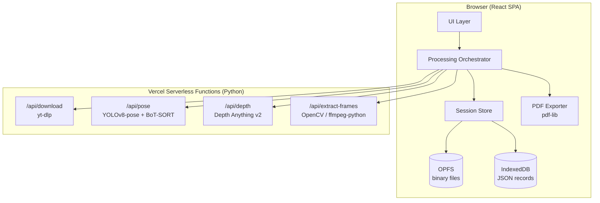

# Design Document

## Dance Formation App

---

## Overview

The Dance Formation App is a React single-page application (SPA) that lets choreographers and coaches analyze dance formations from YouTube videos. The user submits a YouTube URL, selects timestamps, and the system produces top-down formation diagrams and a PDF report for each selected moment.

The architecture is split into two tiers:

- **Browser tier** — React SPA handling all UI, local storage (OPFS + IndexedDB), and orchestration of API calls.
- **Compute tier** — Vercel Python serverless functions performing all heavy computation: video download (yt-dlp), pose estimation (YOLOv8-pose), multi-object tracking (BoT-SORT), and depth estimation (Depth Anything v2).

No user data is persisted server-side. All results are returned to the browser and stored locally.

### Key Design Decisions

| Decision | Choice | Rationale |
|---|---|---|
| Frontend framework | React (SPA) | Confirmed by user; rich ecosystem for canvas/PDF work |
| Large binary storage | OPFS | Browser-native, high-throughput, no size limits for video/frames |
| Structured data storage | IndexedDB | Transactional, queryable JSON store for session metadata |
| Video download | yt-dlp via Vercel Python function | Reliable, actively maintained, supports format selection |
| Pose estimation | YOLOv8-pose (Ultralytics) | Best accuracy/speed tradeoff; BoT-SORT is natively integrated |
| Tracking | BoT-SORT (via Ultralytics) | Re-ID across frames; built into Ultralytics tracking API |
| Depth estimation | Depth Anything v2 | NeurIPS 2024; 10× faster than diffusion-based alternatives |
| Deployment | Vercel | Confirmed; Python runtime supports 500 MB bundle, 300 s default timeout |
| PDF generation | pdf-lib (browser-side) | Pure JS, no server round-trip needed for PDF assembly |

### Critical Constraint: Vercel Function Size

The Ultralytics + Depth Anything v2 model weights are large. The design uses **separate Vercel functions per compute operation** so each function's bundle stays within the 500 MB Python limit. Model weights are loaded from Hugging Face Hub at cold-start rather than bundled.

---

## Architecture



### Data Flow Summary

1. User submits YouTube URL → `/api/download` returns video binary → stored in OPFS.
2. User selects timestamps → `/api/extract-frames` returns frame images → stored in OPFS.
3. Processing initiated → `/api/pose` runs full-video scan → returns dancer track data → stored in IndexedDB.
4. Per-frame pose detection → `/api/pose` returns per-frame keypoints + track IDs → stored in IndexedDB.
5. `/api/depth` returns depth map for representative frames → stored in IndexedDB.
6. Formation_Mapper (browser-side) applies homography → renders Formation_Images → stored in OPFS.
7. PDF_Exporter assembles PDF from OPFS frames + Formation_Images + IndexedDB metadata.

---

## Components and Interfaces

### Browser Components

#### `YouTubeImporter`
Handles URL input, validation, and video metadata retrieval.

```typescript
interface VideoMeta {
  videoId: string;
  title: string;
  durationSeconds: number;
  thumbnailUrl: string;
}

interface YouTubeImporter {
  validateUrl(url: string): { valid: boolean; error?: string };
  fetchMeta(url: string): Promise<VideoMeta>;
  downloadVideo(url: string): Promise<void>; // streams to OPFS
}
```

#### `TimestampSelector`
Manages the list of user-selected timestamps with validation.

```typescript
interface Timestamp {
  id: string;
  valueSeconds: number;
  label: string; // HH:MM:SS display
}

interface TimestampSelector {
  addTimestamp(valueSeconds: number, durationSeconds: number): Result<Timestamp, string>;
  removeTimestamp(id: string): void;
  getTimestamps(): Timestamp[];
}
```

#### `ProcessingOrchestrator`
Coordinates the multi-step processing pipeline, managing state transitions and API calls.

```typescript
type ProcessingStep =
  | 'idle'
  | 'downloading'
  | 'extracting_frames'
  | 'scanning_dancers'
  | 'analyzing_depth'
  | 'detecting_positions'
  | 'mapping_formations'
  | 'complete'
  | 'error';

interface OrchestratorState {
  step: ProcessingStep;
  progress: number; // 0–100
  error?: string;
}
```

#### `DancerProfileManager`
Displays detected dancers and allows name assignment.

```typescript
interface DancerProfile {
  id: string;           // stable track ID from BoT-SORT
  numericLabel: number; // assigned sequential number
  customName?: string;
  visualDescription: string; // AI-generated description
  thumbnailDataUrl: string;  // crop from first detection
}
```

#### `FormationMapper`
Browser-side component that applies the perspective homography to produce top-down coordinates and renders Formation_Images to an HTML Canvas.

```typescript
interface FloorCoordinate {
  dancerId: string;
  x: number; // normalized 0–1 on floor plane
  y: number;
}

interface FormationMapper {
  computeHomography(depthCalibration: DepthCalibration): HomographyMatrix;
  projectToFloor(pixelCoords: PixelCoordinate[], H: HomographyMatrix): FloorCoordinate[];
  renderFormationImage(coords: FloorCoordinate[], profiles: DancerProfile[]): HTMLCanvasElement;
}
```

#### `SessionStore`
Abstraction layer over OPFS and IndexedDB.

```typescript
interface SessionStore {
  // Binary (OPFS)
  writeVideo(sessionId: string, data: ArrayBuffer): Promise<void>;
  readVideo(sessionId: string): Promise<ArrayBuffer>;
  writeFrame(sessionId: string, timestampId: string, data: ArrayBuffer): Promise<void>;
  readFrame(sessionId: string, timestampId: string): Promise<ArrayBuffer>;
  writeFormationImage(sessionId: string, timestampId: string, data: ArrayBuffer): Promise<void>;
  readFormationImage(sessionId: string, timestampId: string): Promise<ArrayBuffer>;

  // Structured (IndexedDB)
  saveSession(session: Session): Promise<void>;
  loadSession(sessionId: string): Promise<Session>;
  listSessions(): Promise<SessionSummary[]>;
  deleteSession(sessionId: string): Promise<void>; // removes OPFS + IDB records
}
```

#### `PDFExporter`
Assembles the PDF report using `pdf-lib`.

```typescript
interface PDFExporter {
  export(session: Session): Promise<Uint8Array>; // returns PDF bytes
}
```

---

### Vercel API Routes (Python)

All routes accept and return JSON (or binary where noted). All routes are HTTPS-only.

#### `POST /api/download`
Downloads a YouTube video using yt-dlp and returns the video binary.

**Request:**
```json
{ "url": "https://www.youtube.com/watch?v=..." }
```

**Response:** `application/octet-stream` (video binary) or JSON error.

**Implementation notes:**
- yt-dlp is invoked via Python subprocess with `--format bestvideo[height<=1080]+bestaudio/best`.
- Output is written to `/tmp` (Vercel ephemeral storage), then streamed back.
- Returns video metadata headers: `X-Video-Title`, `X-Video-Duration`.

#### `POST /api/extract-frames`
Extracts frames at specified timestamps from a video binary.

**Request:** `multipart/form-data` — video file + JSON timestamps array.

**Response:** `multipart/form-data` — one JPEG per timestamp.

**Implementation notes:**
- Uses `ffmpeg-python` (wraps ffmpeg binary) to seek and extract frames.
- Minimum output resolution: 720p.

#### `POST /api/pose`
Runs YOLOv8-pose + BoT-SORT on provided frames.

**Request:** `multipart/form-data` — one or more JPEG frames + `mode` (`full_scan` | `per_frame`).

**Response:**
```json
{
  "tracks": [
    {
      "trackId": "1",
      "detections": [
        {
          "frameIndex": 0,
          "bbox": [x1, y1, x2, y2],
          "keypoints": [[x, y, confidence], ...],  // 17 COCO keypoints
          "centroid": [cx, cy]
        }
      ]
    }
  ]
}
```

**Implementation notes:**
- Uses `ultralytics` Python package: `model.track(source, tracker="botsort.yaml")`.
- In `full_scan` mode, samples frames at 2 fps across the full video to build stable track IDs.
- In `per_frame` mode, matches detections to existing track IDs using the established gallery.
- Model: `yolov8m-pose.pt` (medium — balance of accuracy and speed within Vercel timeout).

#### `POST /api/depth`
Runs Depth Anything v2 on a representative frame.

**Request:** `multipart/form-data` — one JPEG frame.

**Response:**
```json
{
  "depthMap": [[...]], // 2D array of relative depth values (0–1, normalized)
  "width": 1280,
  "height": 720
}
```

**Implementation notes:**
- Uses `transformers` library with `depth-anything/Depth-Anything-V2-Small-hf` (smallest variant to fit within timeout).
- Depth map is relative (not metric); used for perspective calibration, not absolute measurement.

---

## Data Models

### Session (IndexedDB)

```typescript
interface Session {
  id: string;                    // UUID
  createdAt: string;             // ISO 8601
  updatedAt: string;
  youtubeUrl: string;
  videoId: string;
  videoTitle: string;
  videoDurationSeconds: number;
  thumbnailUrl: string;
  timestamps: Timestamp[];
  dancerProfiles: DancerProfile[];
  environmentType: EnvironmentType;
  depthCalibration: DepthCalibration;
  formations: Formation[];
  opfsVideoPath: string;         // path within OPFS
}

type EnvironmentType = 'stage' | 'studio' | 'outdoor' | 'unknown' | 'manual';

interface DepthCalibration {
  homographyMatrix: number[][];  // 3×3
  environmentType: EnvironmentType;
  confidence: number;            // 0–1
  frameIndex: number;            // which frame was used for calibration
}

interface Formation {
  timestampId: string;
  timestampSeconds: number;
  dancerPositions: DancerPosition[];
  opfsFramePath: string;
  opfsFormationImagePath: string;
}

interface DancerPosition {
  dancerId: string;
  pixelCoordinate: [number, number];
  floorCoordinate: [number, number]; // normalized 0–1
  absent: boolean;
}
```

### Metadata JSON Export Schema

```json
{
  "$schema": "https://dance-formation-app/schemas/session-export-v1.json",
  "schemaVersion": "1.0",
  "exportedAt": "2024-01-01T00:00:00Z",
  "session": {
    "youtubeUrl": "string",
    "videoTitle": "string",
    "videoDurationSeconds": "number",
    "environmentType": "string",
    "timestamps": [
      {
        "id": "string",
        "valueSeconds": "number",
        "label": "string",
        "formationImageFilename": "string | null"
      }
    ],
    "dancerProfiles": [
      {
        "id": "string",
        "numericLabel": "number",
        "customName": "string | null",
        "visualDescription": "string"
      }
    ]
  }
}
```

### OPFS Directory Layout

```
/sessions/
  {sessionId}/
    video.mp4
    frames/
      {timestampId}.jpg
    formations/
      {timestampId}.png
```

---

## Correctness Properties

*A property is a characteristic or behavior that should hold true across all valid executions of a system — essentially, a formal statement about what the system should do. Properties serve as the bridge between human-readable specifications and machine-verifiable correctness guarantees.*

### Property 1: Timestamp validation rejects out-of-range values

*For any* video duration D and any timestamp value T, if T < 0 or T > D, then `addTimestamp(T, D)` SHALL return an error result and the timestamp list SHALL remain unchanged.

**Validates: Requirements 2.4, 2.5**

---

### Property 2: Timestamp validation accepts in-range values

*For any* video duration D and any timestamp value T where 0 ≤ T ≤ D, `addTimestamp(T, D)` SHALL return a success result and the timestamp list length SHALL increase by exactly one.

**Validates: Requirements 2.4**

---

### Property 3: Session metadata JSON round-trip

*For any* valid Session object, serializing it to the export JSON format and then re-importing it SHALL produce a Session with equivalent `youtubeUrl`, `timestamps`, `dancerProfiles`, and `environmentType` fields.

**Validates: Requirements 9.3, 9.4**

---

### Property 4: Session deletion removes all associated data

*For any* Session that has been saved (with associated OPFS binary files and IndexedDB records), calling `deleteSession(sessionId)` SHALL result in: (a) the session no longer appearing in `listSessions()`, and (b) all OPFS paths associated with that session being absent.

**Validates: Requirements 8.6**

---

### Property 5: Dancer position storage round-trip

*For any* set of dancer positions detected in a frame, storing them via `SessionStore` and then reading them back SHALL produce an equivalent set of positions with the same dancer IDs, pixel coordinates, and absence flags.

**Validates: Requirements 6.4**

---

### Property 6: Formation floor coordinates are normalized

*For any* set of pixel coordinates projected through `FormationMapper.projectToFloor`, all resulting floor coordinates SHALL have x ∈ [0, 1] and y ∈ [0, 1].

**Validates: Requirements 7.1, 7.2**

---

### Property 7: Compute API error responses are structured

*For any* Compute_API route invocation that results in an error, the response SHALL contain a JSON body with a non-empty `error` string field and an HTTP status code ≥ 400.

**Validates: Requirements 12.5**

---

### Property 8: Incomplete session export uses null for missing fields

*For any* Session where one or more optional fields (e.g., `formationImageFilename`) have not been populated, the exported JSON SHALL include those fields with a `null` value rather than omitting them.

**Validates: Requirements 9.5**

---

## Error Handling

### API Error Contract

All Vercel Python functions return a consistent error envelope:

```json
{
  "error": "Human-readable description",
  "code": "MACHINE_READABLE_CODE",
  "details": {}
}
```

HTTP status codes:
- `400` — invalid input (bad URL, out-of-range timestamp, malformed request)
- `403` — video inaccessible (private, age-restricted)
- `422` — processing failure (pose detection failed, depth estimation failed)
- `500` — unexpected server error
- `504` — function timeout

### Browser-Side Error Handling

The `ProcessingOrchestrator` catches all API errors and transitions to the `error` state with a user-facing message. Each processing step is independently retryable — the orchestrator tracks which steps have completed so a retry resumes from the failed step rather than restarting.

### Specific Error Cases

| Scenario | Handling |
|---|---|
| Invalid YouTube URL | Client-side regex validation before API call |
| Private/age-restricted video | `/api/download` returns 403; UI shows descriptive message |
| Frame extraction failure | Log failure, mark timestamp as failed, continue with remaining timestamps |
| Dancer not detected in frame | Mark dancer as `absent: true` for that timestamp |
| Perspective transform fails | Skip Formation_Image; include raw frame in PDF with note |
| Environment confidence too low | Prompt user to manually select environment type |
| OPFS quota exceeded | Surface storage warning; suggest deleting old sessions |
| Vercel function timeout | Return partial results where possible; surface timeout error to user |

---

## Testing Strategy

### Unit Tests (Vitest)

Focus on pure functions and browser-side logic:

- `YouTubeImporter.validateUrl` — URL parsing and validation rules
- `TimestampSelector.addTimestamp` — boundary validation logic
- `FormationMapper.projectToFloor` — homography math
- `SessionStore` — OPFS/IndexedDB read/write with mocked browser APIs
- Metadata JSON serialization/deserialization — schema conformance
- PDF assembly — structure and content of generated PDF

### Property-Based Tests (fast-check, minimum 100 iterations each)

Each property test references its design property via a comment tag:
`// Feature: dance-formation-app, Property N: <property_text>`

- **Property 1 & 2**: Generate random `(duration, timestamp)` pairs; verify `addTimestamp` accepts/rejects correctly.
- **Property 3**: Generate random Session objects; verify JSON round-trip preserves key fields.
- **Property 4**: Generate random sessions with OPFS/IDB entries; verify deletion removes all traces.
- **Property 5**: Generate random dancer position sets; verify storage round-trip fidelity.
- **Property 6**: Generate random pixel coordinates and homography matrices; verify all projected floor coordinates are in [0, 1].
- **Property 7**: Simulate API error conditions; verify all error responses conform to the error envelope schema.
- **Property 8**: Generate sessions with varying degrees of completeness; verify null-filling behavior.

**PBT library**: [`fast-check`](https://github.com/dubzzz/fast-check) (TypeScript-native, well-maintained).

### Integration Tests

- `/api/download` — test with a known public YouTube URL (short video); verify binary returned and metadata headers present.
- `/api/extract-frames` — test with a sample video; verify JPEG frames returned at correct timestamps.
- `/api/pose` — test with a sample frame containing people; verify track IDs and keypoints in response.
- `/api/depth` — test with a sample frame; verify depth map dimensions match input.

### End-to-End Tests (Playwright)

- Full happy path: URL → timestamps → process → formation view → PDF download.
- Error path: invalid URL shows error message.
- Session persistence: reload page, verify session loads from IndexedDB.

### Vercel Deployment Smoke Tests

- App loads within 3 seconds on broadband (Lighthouse CI).
- All API routes respond over HTTPS.
- CORS headers present on API routes.
